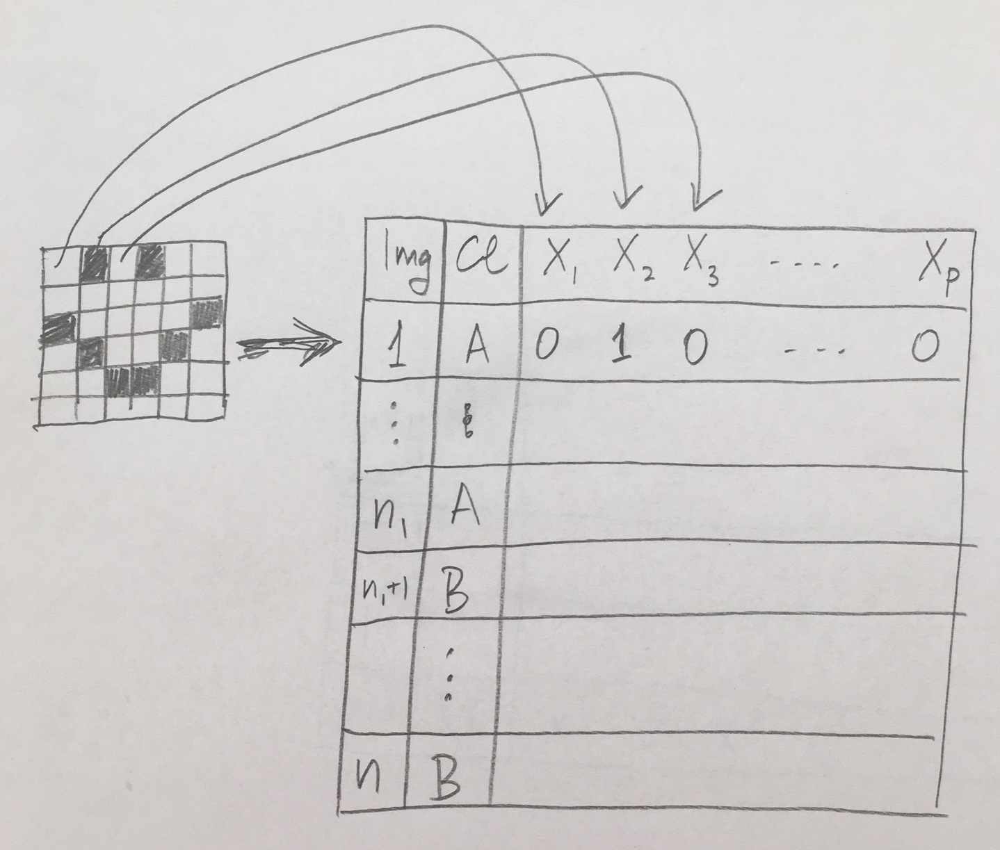
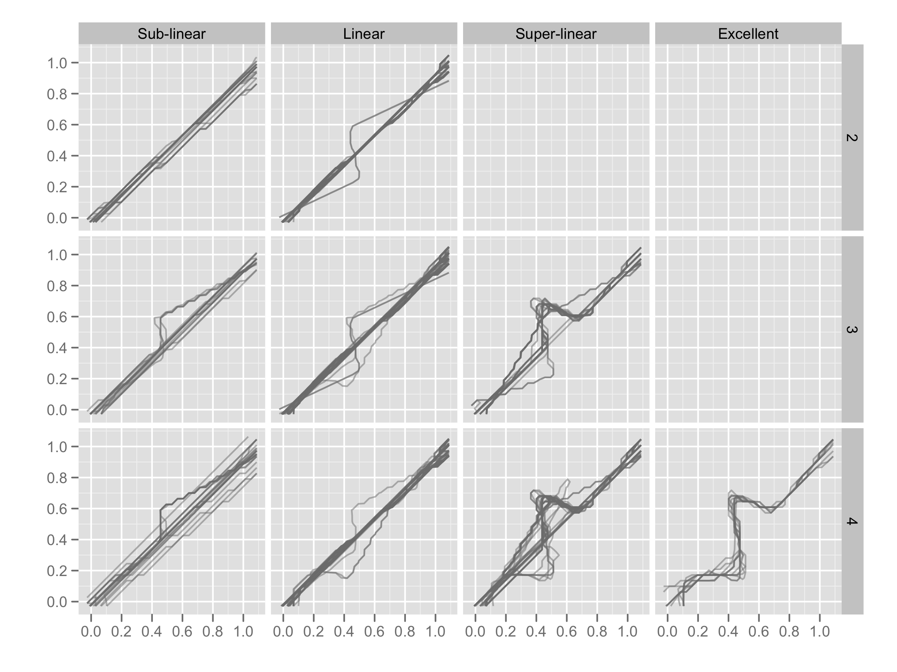
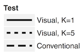

class: inverse middle center

```{r initial, echo = FALSE, cache = FALSE, warning = FALSE, message = FALSE, error=FALSE, results = 'hide'}
library(knitr)
options(htmltools.dir.version = FALSE, tibble.width = 60)
opts_chunk$set(
  echo = FALSE, 
  warning = FALSE, 
  message = FALSE, 
  error=FALSE, 
  comment = "#>",
  fig.path = 'figure/', 
  cache.path = 'cache/', 
  fig.align = 'center', 
  fig.width = 12, 
  fig.height = 11, 
  fig.show = 'hold', 
  cache = FALSE, 
  external = TRUE, 
  dev = 'svglite'
)
library(tidyverse)
library(ochRe)
library(kableExtra)
```


Hands up if you have fitted a model in the last week
--

<br>
<br>
<br>
Keep your hand up if you also looked at a residual plot from that model fit
--

---

background-image: url(images/cartoon.png)
background-size: 100%

---

background-image: url(images/housekeeping.png)
background-size: 100%

---

background-image: url(images/robot.png)
background-size: 100%

---

# Outline

- Deep learning: image recognition
- Visual inference: process and framework
- Experiment
- Results
- Appplications
- Acknowledgements and references

```{r eval=FALSE}
df <- tibble(fitted = runif(500), resid = rnorm(500))
ggplot(df, aes(x=fitted, y=resid)) + 
  geom_point() +
  xlab("Fitted values") +
  ylab("Residuals")
```

---
.left-column[
# Deep learning
## What?
]
.right-column[

- Neural network model 
- Includes a transformation (convolution) stage
- Demonstrated success with image classification. 


*Source: [Abdellatif Abdelfattah](https://medium.com/@tifa2up/image-classification-using-deep-neural-networks-a-beginner-friendly-approach-using-tensorflow-94b0a090ccd4)*
]

---
.left-column[
# Deep learning
## What?
## Neural network
]
.right-column[
A linear model can be thought of as a neural network:


]

---
.left-column[
# Deep learning
## What?
## Neural network
]
.right-column[
A simple neural network, contains a hidden layer, to increase/decrease dimensionality, and a transformation through a (logistic) function:


]

---
.left-column[
# Deep learning
## What?
## Neural network
]
.right-column[
Example from Wickham et al (2015) "Removing the blindfold"


]

---
.left-column[
# Deep learning
## What?
## Neural network
## Convolutional NN
]
.right-column[

Thinking about images as data


]

---
.left-column[
# Deep learning
## What?
## Neural network
## Convolutional NN
]
.right-column[

- Proximity in an image matters though. 
- The dimension reduction takes into account of neighbouring cells in the image, using filters


]

---
.left-column[
# Deep learning
## What?
## Neural network
## Convolutional NN
]
.right-column[

Applying multiple filters


]

---
.left-column[
# Deep learning
## What?
## Neural network
## Convolutional NN
## Software
]
.right-column[

The [keras](https://keras.rstudio.com) package in R, interfaces to python software, provides a convenient way to fit the convolutional neural network. 


]
---
# Model set up

- Formulate the problem as a classification task: "good" vs "bad" residual plot
- Simulate an enormous number of both types of residual plots
- Train the model on half of these
- Choose the best model by accuracy with the other half

---

background-image: url(images/training.png)
background-size: 100%

*Source: Shuofan Zhang*
---

background-image: url(images/whatdidyousay.gif)
background-size: 100%

---

.left-column[
# Fitting neural networks is difficult


Wickham et al (2015)

]
.right-column[



]

---
# Model training

1.Simulate data (X, Y) from the null and the alternative models.

2.Generate scatterplots of X and Y

3.Save scatter plots as 150 × 150 pixels images

4.Train a deep learning classifier to recognise the patterns from two groups

5.Test the model's performance on new data and compute the accuracy

6.One model chosen as the best, to compare performance with humans

---
.left-column[
# Human evaluation
## Lineup protocol
]
.right-column[
- Statistical inference with graphics, follows classical hypothesis testing procedures
- Lineup protocol embeds the data plot among a field of null plots (comparison of test statistic with sampling distribution)
- Human observers pick plot that is most different from the others
- P-value calculated from the probability that the data plot is selected by chance

[Buja et al (2009)](http://rsta.royalsocietypublishing.org/content/367/1906/4361) ideas, [Majumder et al (2013)](https://www.tandfonline.com/doi/abs/10.1080/01621459.2013.808157) validation

]

---

background-image: url(images/diaghm.png)
background-size: 100%

*Source: Shuofan Zhang*

---
.left-column[
# Human evaluation
## Lineup protocol
## Database
]
.right-column[

- [Majumder et al (2013)](https://www.tandfonline.com/doi/abs/10.1080/01621459.2013.808157) conducted validation study to compare the performance of the lineup protocol, assessed by human evaluators, in comparison to the classical test
- Experiment 2 examined $H_o: \beta_k = 0 ~~vs ~~H_a: \beta_k \neq 0$
- 70 lineups of size 20 plots: $n=100, 300; \beta \in [-6, 4.5]; \sigma=5, 12$
- 351 evaluations by human subjects
- Amazon's Mechanical Turk used to recruit observers

]

---

.left-column[
# Human evaluation
## Lineup protocol
## Database
## Try it
]
.right-column[
Let's do a couple:

<br>
<br>

*From the field of 20 plots shown, pick the plot with the strongest linear relationship between the two variables.*
]

---

background-image: url(images/plot_turk2_300_150_5_3.png)
background-size: 70%

---

.left-column[
# Human evaluation
## Lineup protocol
## Database
## Try it
]
.right-column[
<br>
<br>
<br>
*If you chose 19 you picked the data plot.*

In the Turk study 76/78 observers chose plot 19. The estimated p-value is 0. It is very unlikely to see this result if the data plot was a sample a population with no relationahip between the variables. 


]

---

background-image: url(images/plot_turk2_300_10_5_3.png)
background-size: 70%

```{r eval=FALSE}
turk <- read_csv("data/data_turk2.csv")
turk %>% filter(pic_name == "plot_turk2_300_150_5_3.png") %>%
  count(response)
library(nullabor)
pvisual(76, 78)
turk %>% filter(pic_name == "plot_turk2_300_10_5_3.png") %>%
  count(response)
turk %>% filter(pic_name == "plot_turk2_300_10_5_3.png") %>%
  count(response_no)
pval <- read_csv("data/pvalue_turk2.csv")
pval %>% filter(pic_name == "plot_turk2_300_10_5_3.png") 
```

---

.left-column[
# Human evaluation
## Lineup protocol
## Database
## Try it
]
.right-column[
<br>
<br>
<br>
*If you chose 18 you picked the data plot.*

In the Turk study 0/19 observers chose plot 18. The estimated p-value is 1. It is very likely to see this result if the data plot was a sample a population with no relationahip between the variables. 

11/19 chose plot number 19. This plot is the plot in the field that has the smallest p-value. People do tend to pick the plot that has the smallest p-value (or the most structure). 

]

---

.left-column[
# Human evaluation
## Lineup protocol
## Database
## Try it
## Validation

*[Majumder et al (2013)](https://www.tandfonline.com/doi/abs/10.1080/01621459.2013.808157)*

]
.right-column[





]
---
.left-column[
# Human vs computer
## Comparison
]
.right-column[

$H_o: \beta_k = 0 ~~vs ~~H_a: \beta_k \neq 0$

Linear vs no relationship (null)

]

---
.left-column[
# Human vs computer
## Comparison
## Computer model
]
.right-column[

Simulation 

$$Y_i = \beta_0 + \beta_1 X_{i}  + \varepsilon_i, ~~i=1, \dots , n$$

- $X \sim N[0,\ 1]$
- $\beta_0 = 0$ (intercept)
- $\beta_1\sim U[-10, -0.1] \bigcup [0.1, 10]$  (linear, null when $\beta_1=0$)
- $\varepsilon\sim N(0, \sigma^2) \ where\ \sigma \sim U[1,12]$ 
- $n=U[50,500]$  
- 200,000 from each linear and null scenario generated
]
---
.left-column[
# Human vs computer
## Comparison
## Computer model
]
.right-column[

]

---
.left-column[
# Human vs computer
## Comparison
## Computer model
]
.right-column[

]
---
.left-column[
# Human vs computer
## Comparison
## Computer model
## Testing
]
.right-column[

### Computer model prediction

- Re-generate the 70 *data plots* using the same data in Turk study (without null plots)
- Use the computer model to predict whether the 70 data plots were "linear" or "null"
- The computer model's predicted accuracy over the 70 data plots are recorded as the model's performance.
]

---
.left-column[
# Human vs computer
## Comparison
## Computer model
## Testing
]
.right-column[

### Human subjects results

- Calculate p-value associated with each lineup using the binomial formula (from Majumder), with N=number of evaluations and k=number of people choosing data plot
- Draw conclusion: reject the null when the calculated p-value is smaller than $\alpha$.
- The accuracy of the conclusions over the 70 lineups 
]
---

background-image: url(images/drumroll.gif)
background-size: 100%

---
.left-column[
# Human vs computer
## Comparison
## Computer model
## Testing
## Results
]
.right-column[


Humans beat computers, this time. 

]
---

# Summary

- Computer model trained specifically on detecting linear vs no relationship, comes close but does not beat human evaluation
- Results are promising for the future - actually in a another experiment conducted on heteroskedasticity vs not, computer wins BUT we did not have a big database of human evaluations on which to make comparison

---
# Discussion

Graphics are important in data analysis

```{r fig.height=6}
library(datasauRus)
mydsdz <- datasaurus_dozen %>% filter(dataset != "slant_up")
ggplot(mydsdz, aes(x=x, y=y)) + 
  geom_point() +
  facet_wrap(~dataset, ncol=4) + 
  theme(aspect.ratio=1)
```

*Source: [Matejka, J. and Fitzmaurice, G. (2017)](https://www.autodeskresearch.com/publications/samestats) and [Locke, S. and D'Agostino McGowan, L. (2018)](https://CRAN.R-project.org/package=datasauRus)*

---

Same numerical statistics but radically different structure

```{r}
mydsdz %>% group_by(dataset) %>%
  summarise(mx=round(mean(x), 1), 
            my=round(mean(y), 1),
            sx=round(sd(x), 1), 
            sy=round(sd(y), 1),
            r = round(cor(x, y), 1)) %>%
  kable() %>% kable_styling()
```

---

[Residual (Sur)Realism](https://www4.stat.ncsu.edu/~stefanski/nsf_supported/hidden_images/stat_res_plots.html#Download_Data_Sets) or how to hide images in your residuals.

```{r fig.height=7}
library(sawfish)
fl <- find_files("https://www4.stat.ncsu.edu/~stefanski/nsf_supported/hidden_images/box_quote_files/", "txt")
d <- matrix(scan(paste0(attr(fl, "base"), fl[1])), ncol=5, byrow=TRUE)
colnames(d) <- c("y", paste0("x",1:4))
d <- as_tibble(d)
library(GGally)
scatmat(d)
```

Looks like boring data.

---

Fit a linear model, plot the residuals

```{r fig.height=7}
fit <- lm(y~x1+x2+x3+x4, data=d)
library(broom)
fit_aug <- augment(fit, d)
ggplot(fit_aug, aes(x=.fitted, y=.resid)) + geom_point()
```

---
# To the future `r icon::fa_rocket()`

- Model checking may be systematic enough to automate
- Expand the computer model with simulations of all sorts of departures from no relationship
- The lineup protocol, from visual inference, provides a way to check and validate the models - may need to build up more human subject evaluations
- Extend to new areas like high throughput genomics problems

---

background-image: url(images/Rosie.png)
background-size: 100%

---

class: inverse 

# Joint work!

- Deep learning model, human vs computer comparison: Monash Masters thesis by Shuofan Zhang (inspired by a blog post by [Giora Simchoni](http://giorasimchoni.com/2018/02/07/2018-02-07-book-em-danno/))
- Inference: Heike Hofmann, Mahbub Majumder, Andreas Buja, Hadley Wickham, Eric Hare, Susan Vanderplas, Adam Loy, Niladri Roy Chowdhury, Nat Tomasetti.

Contact: [`r icon::fa_envelope()`](http://www.dicook.org) dicook@monash.edu, [`r icon::fa_twitter()`](https://twitter.com/visnut) visnut, [`r icon::fa_github()`](https://github.com/dicook) dicook

.footnote[Slides made with Rmarkdown, xaringan package by Yihui Xie, and lorikeet theme using the [ochRe package](https://github.com/ropenscilabs/ochRe). Available at [github.com/dicook/Belz-Cook](https://github.com/dicook/Belz-Cook).]

---
# Further reading

- Buja et al (2009) Statistical Inference for Exploratory Data Analysis and Model Diagnostics, Roy. Soc. Ph. Tr., A
- Majumder et al (2013) Validation of Visual Statistical Inference, Applied to Linear Models, JASA
- Wickham et al (2010) Graphical Inference for Infovis, InfoVis, Best paper
- Hofmann et al (2012) Graphical Tests for Power Comparison of Competing Design, InfoVis
    
---
class: middle center

<a rel="license" href="http://creativecommons.org/licenses/by-sa/4.0/"></a><br />This work is licensed under a <a rel="license" href="http://creativecommons.org/licenses/by-sa/4.0/">Creative Commons Attribution-ShareAlike 4.0 International License</a>.

